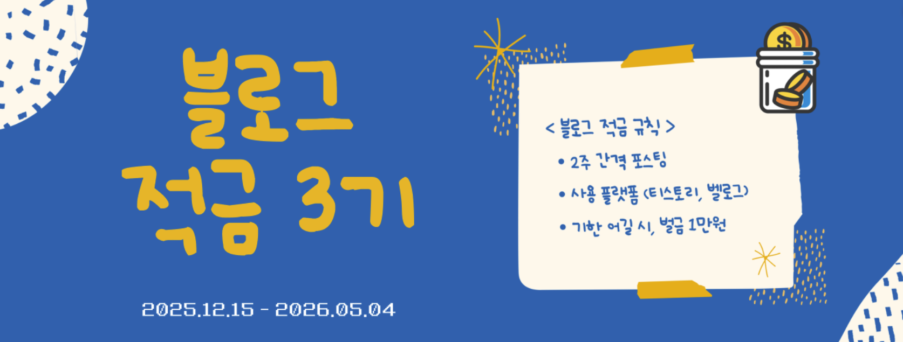

# 💰 블로그 적금 Season 3 💰

꾸준한 글쓰기 습관을 기르기 위한 블로그 작성 모임입니다.

 

## 📝 모임 소개

☑️ **2주마다 블로그 글 작성**
- 플랫폼은 자유
- 글자 수 최소 1,000자
- 작성한 글의 링크는 톡방에 자유롭게 공유

☑️ **기한 내 미작성 시 벌금 1만 원**
- 카카오뱅크 모임통장에 입금

☑️ **모임 목적**
- 블로그 작성을 습관화하고, 자기계발 및 이직/취업에 도움을 주기 위함

 

## 📅 활동 기간

☑️ 기간 : **2025.12.15(월) ~ 2026.05.04(월)**
☑️ 참고 : **1회차는 적응을 고려하여 3주**, 이후는 2주 단위

| 회차 | 작성 기간           | 검사일    |
| --- |-----------------|--------|
| 1회차 | 12-15일 ~ 12-28일 | 12-29일 |
| 2회차 | 12-29일 ~ 01-11일 | 01-12일 |
| 3회차 | 01-12일 ~ 01-25일 | 01-26일 |
| 4회차 | 01-26일 ~ 02-08일 | 02-09일 |
| 5회차 | 02-09일 ~ 02-22일 | 02-23일 |
| 6회차 | 02-23일 ~ 03-08일 | 03-09일 |
| 7회차 | 03-09일 ~ 03-22일 | 03-23일 |
| 8회차 | 03-23일 ~ 04-05일 | 04-06일 |
| 9회차 | 04-06일 ~ 04-19일 | 04-20일 |
| 10회차 | 04-20일 ~ 05-03일 | 05-04일 |

 

## ✅ 세부 규칙

1. **일요일 자정까지 등록된 글만 인정**
2. **검사일은 다음날인 월요일**
3. **기한 내 미작성 시 벌금 1만 원 입금**
    - 입금 계좌: *카카오뱅크 모임통장 (비공개, 톡방 참고)*
    - 입출금 내역은 모든 참여자가 열람 가능
4. **모인 벌금은 회식비로 사용**
    - 입금자 여부와 무관하게 당일 전액 사용 예정
5. **깃헙 컨벤션**
    - **커밋메시지** : `round01_홍길동`

 

## ⚠️ 유의사항

1. **작성일 기준 회차에 맞게 등록해야 함**
    - 예: 12월 26일 작성 → 1회차 등록만 가능
2. **중도 탈퇴 시 사전 논의 필수**
3. **이미 납부된 벌금은 환불 불가**
4. **벌금 입금은 지체 없이 진행**
5. **서로의 블로그에 댓글 또는 피드백 적극 권장**

 

## 🎯 목표

- 성실한 기록 습관 형성 및 자기 성장
- 다른 포지션에 대한 이해 증진

